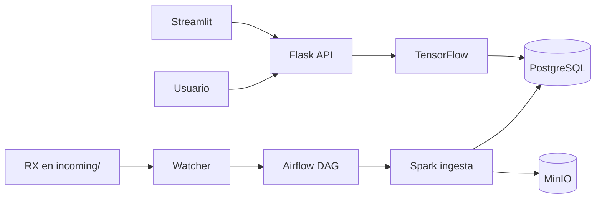

# salle-hospital — laSalle Health Center

Sistema inteligente de soporte hospitalario: pipeline Big Data, clasificación de radiografías de tórax (**Sana / Neumonía / COVID-19**), API clínica y dashboard operativo.

**Documentación principal:** [Estructura del repo](docs/estructura-repositorio.md) · [Memoria técnica](docs/memoria-tecnica.md) · [Diagramas](docs/diagramas.md) · [Ética](docs/etica.md) · [Diario IA](docs/diario-ia/)

---

## Stack

| Componente | Tecnología | Puerto |
|------------|------------|--------|
| API + UI web | **Flask** (Gunicorn) | 8000 |
| Inferencia ML | TensorFlow + **FastAPI** | 8001 |
| Big Data | Apache Spark (PySpark 3.5) | 7077 / UI 8080 |
| Orquestación | Apache Airflow 2.10 | 8081 |
| Base de datos | PostgreSQL 16 | 5432 |
| Objetos (RX) | MinIO (S3) | 9000 / consola 9001 |
| Dashboard | Streamlit | 8501 |
| Logs (centralizado) | MongoDB 7 | 27017 |
| Infra | Docker Compose | — |

---

## Arranque rápido

```bash
cp .env.example .env
docker compose up -d --build
```

> Si PostgreSQL ya existía sin la BD `airflow`:  
> `docker compose down -v && docker compose up -d --build`

### Verificación integral (sin entrenar modelos)

```bash
./scripts/verify_stack.sh
# Solo comprobar con stack ya levantado:
SKIP_COMPOSE_UP=1 ./scripts/verify_stack.sh
# Guardar log en archivo:
VERIFY_LOG=logs/verify_stack.log ./scripts/verify_stack.sh
```

Al final imprime una **tabla resumen** (OK / WARN / FAIL). Si la UI de Airflow no responde en `:8081` pero el scheduler está bien, verás **WARN** y el script puede seguir en verde; prueba `docker compose restart airflow`.

### URLs y credenciales

| Servicio | URL | Acceso |
|----------|-----|--------|
| **UI hospital (Flask)** | http://localhost:8000 | Pacientes, upload RX, resumen |
| **API health** | http://localhost:8000/health | — |
| **ML** | http://localhost:8001/health | — |
| **Dashboard Streamlit** | http://localhost:8501 | Métricas, alertas, pipeline |
| **Airflow** | http://localhost:8081 | `.env` → `AIRFLOW_ADMIN_USER` / `AIRFLOW_ADMIN_PASSWORD` (por defecto `admin` / `Admin123.`) |
| **MinIO consola** | http://localhost:9001 | `.env` → `MINIO_ROOT_*` |
| **Spark Master UI** | http://localhost:8080 | — |
| **PostgreSQL** | `localhost:5432` | `.env` → `POSTGRES_*` |
| **MongoDB (logs)** | `localhost:27017` | `.env` → `MONGO_*` (mismas credenciales que Postgres en dev) |

### Consultar logs en MongoDB

```bash
docker compose up -d mongodb log-sync
docker exec salle-log-sync python3 /opt/scripts/query_logs.py --limit 20
docker exec salle-mongodb mongosh -u "$MONGO_USER" -p "$MONGO_PASSWORD" --authenticationDatabase admin salle_logs
```

Colecciones: `application_logs` (API, ML, watcher, pipeline), `airflow_logs`, `file_logs` (p. ej. `verify_stack.log`). El daemon `salle-log-sync` vuelca ficheros de `airflow/logs/` y `logs/` cada 60 s.

---

## Estructura del repositorio

Árbol completo y convenciones: **[`docs/estructura-repositorio.md`](docs/estructura-repositorio.md)** (documento canónico).

```
practica-tocha/
├── api/                 # Flask: REST + UI (routes → services → repositories)
├── ml/                  # scripts/ (entrenamiento) + app/ (inferencia FastAPI)
├── pipeline/jobs/       # PySpark: ingesta, preprocesado, db_log
├── dashboard/app/       # Streamlit → API /api/dashboard
├── scripts/             # Watcher, Airflow, alertas, build_clinical_data
├── airflow/             # dags/, config/, logs/
├── infra/               # postgres/, spark/, watcher/
├── data/                # raw/ + processed/ (volumen Docker; ver .gitignore)
├── docs/                # memoria, specs/, diario-ia/, ml/
├── .cursor/skills/      # SDD, diario IA, seguridad
├── docker-compose.yml
├── .env.example
├── enunciado.md
└── AGENTS.md
```

---

## Flujo operativo



1. **Batch:** imágenes en `data/raw/` → job Spark → MinIO + calidad en BD.  
2. **Automático:** copiar JPG a `data/raw/covid19_vs_pneumonia/incoming/train/NORMAL/` → watcher → DAG cada 15 min.  
3. **Clínico:** subir RX en http://localhost:8000 → predicción → ver en dashboard.

Detalle watcher: [`airflow/README.md`](airflow/README.md).

### Automatización

```bash
docker compose up -d watcher airflow pipeline spark-master spark-worker
docker exec salle-airflow airflow dags unpause salle_rx_pipeline
```

### Reentrenamiento diario (01:00, opcional)

DAG `salle_nightly_retrain`: preprocesa **todas** las RX en `raw/` (antiguas + nuevas) y reentrena ResNet50; luego reinicia `salle-ml`.

```bash
docker exec salle-airflow airflow dags unpause salle_nightly_retrain
```

Desactivar: `NIGHTLY_RETRAIN_ENABLED=false` en `.env`. Detalle: [`airflow/README.md`](airflow/README.md).

---

## Entrenamiento del modelo (offline)

```bash
docker compose build ml
docker compose run --rm --no-deps \
  -v ./data:/opt/data -v ./ml/models:/app/models \
  -e FEATURES_ROOT=/opt/data/processed/features \
  ml python scripts/train_resnet50.py
```

Resultados: [`docs/ml/resultados-entrenamiento-v1.md`](docs/ml/resultados-entrenamiento-v1.md) · evaluación clínica: [`docs/ml/evaluacion-clinica-v1.md`](docs/ml/evaluacion-clinica-v1.md).

---

## Arquitectura y datos

| Documento | Contenido |
|-----------|-----------|
| [`docs/estructura-repositorio.md`](docs/estructura-repositorio.md) | Árbol de carpetas (canónico) |
| [`docs/architecture.md`](docs/architecture.md) | Decisiones de diseño |
| [`docs/database-architecture.md`](docs/database-architecture.md) | Esquema PostgreSQL |
| [`docs/diagramas.md`](docs/diagramas.md) | Diagramas Mermaid |
| [`docs/specs/BACKLOG.md`](docs/specs/BACKLOG.md) | Estado SDD |

---

## Desarrollo con IA

Proyecto desarrollado con **Cursor** (Vibe Coding). Prompts, errores y correcciones: [`docs/diario-ia/`](docs/diario-ia/).

Skills del repo: `@salle-sdd`, `@diario-ia`, `@salle-seguridad` (`.cursor/skills/`).

---

## Estado por fases (plan 1–10 mayo)

| Día | Entregable | Estado |
|-----|------------|--------|
| 1 | Infra Docker, Spark, Airflow, estructura | Hecho |
| 2 | Esquema BD, datos ejemplo, ingesta Spark, watcher | Hecho |
| 3 | Preprocesado RX (224×224, augmentation) | Hecho |
| 4 | Arquitectura ML, ResNet50 | Hecho |
| 5 | Entrenamiento v1, comparativa arquitecturas | Hecho |
| 6 | API Flask, pacientes, UI, integración ML | Hecho |
| 7 | Dashboard Streamlit, alertas, robustez API | Hecho |
| 8 | Monitorización, calidad, healthchecks | Hecho |
| 9 | Memoria, diagramas, ética, diario | Hecho |
| 10 | Presentación final | Pendiente |

---

## Persistencia Docker

| Volumen | Contenido |
|---------|-----------|
| `postgres_data` | Hospital + metadatos Airflow |
| `minio_data` | Radiografías |
| `airflow_metadata` | BD interna Airflow |
| `./data` | Raw, processed, flags watcher |

`docker compose down` sin `-v` conserva datos.

---

## Licencia

Proyecto académico — Máster / práctica integrada.
