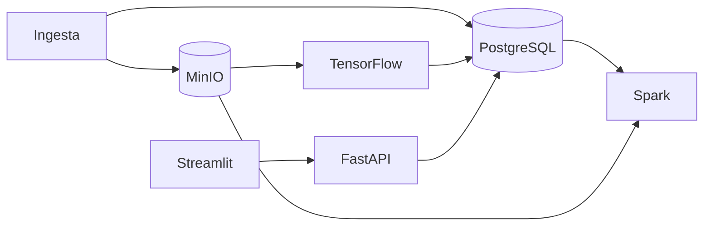

# salle-hospital

Sistema inteligente de soporte hospitalario para **laSalle Health Center**: pipeline de datos a escala, clasificación de radiografías de tórax (Sana / Neumonía / COVID-19) y dashboard operativo.

## Stack

| Componente | Tecnología |
|------------|------------|
| API | FastAPI |
| IA | TensorFlow (Keras) |
| Big Data | Apache Spark (PySpark) |
| Base de datos | PostgreSQL |
| Imágenes / objetos | MinIO |
| Dashboard | Streamlit |
| Infraestructura | Docker Compose |

## Arquitectura

Diagrama y decisiones técnicas: [`docs/architecture.md`](docs/architecture.md).  
Base de datos: [`docs/database-architecture.md`](docs/database-architecture.md).



## Estructura del proyecto

```
├── api/           # REST API
├── dashboard/     # Streamlit
├── ml/            # Modelo y servicio de inferencia (TensorFlow)
├── pipeline/      # Jobs PySpark
├── data/          # Datos locales (gitignored en volumen)
├── docs/          # Documentación
├── infra/         # Configuración auxiliar
└── docker-compose.yml
```

## Requisitos

- Docker 24+ y Docker Compose v2
- (Desarrollo local) Python 3.11+ opcional fuera de contenedores

## Arranque rápido

```bash
cp .env.example .env
docker compose up -d --build
```

> Si PostgreSQL ya existía sin la BD `airflow`, recrea el volumen:  
> `docker compose down -v && docker compose up -d --build`

### Servicios

| Servicio | URL | Credenciales |
|----------|-----|--------------|
| API (FastAPI) | http://localhost:8000/docs | — |
| ML (TensorFlow) | http://localhost:8001/health | — |
| Dashboard (Streamlit) | http://localhost:8501 | — |
| Airflow (standalone) | http://localhost:8081 | `.env` → `AIRFLOW_ADMIN_USER` / `AIRFLOW_ADMIN_PASSWORD` |
| PostgreSQL | `localhost:5432` | ver `.env` |
| MinIO API | http://localhost:9000 | ver `.env` |
| MinIO Console | http://localhost:9001 | ver `.env` |
| Spark Master UI | http://localhost:8080 | — |
| Watcher RX | — (ver logs `docker logs salle-watcher`) | — |

### Automatización (watcher + Airflow)

1. Levantar watcher y despausar el DAG:

```bash
docker compose up -d watcher airflow pipeline spark-master spark-worker
docker exec salle-airflow airflow dags unpause salle_rx_pipeline
```

2. Dejar una imagen en la bandeja de entrada:

```text
data/raw/covid19_vs_pneumonia/incoming/train/NORMAL/mi_rx.jpg
```

3. El watcher la mueve al árbol `raw/`, marca pendiente y el DAG `salle_rx_pipeline` lanza PySpark + MinIO.

Detalle: [`airflow/README.md`](airflow/README.md).

### Persistencia Docker

| Volumen | Contenido |
|---------|-----------|
| `postgres_data` | BD hospital + metadatos Airflow |
| `minio_data` | Objetos RX en MinIO |
| `airflow_metadata` | `airflow.db` y config interna |
| `./data` (bind) | Raw, processed, estado watcher |
| `./airflow/logs` (bind) | Logs de tareas y scheduler |

`docker compose down` **sin** `-v` conserva los volúmenes nombrados.

## Estado del proyecto

| Día | Entregable | Estado |
|-----|------------|--------|
| 1 (1 may) | Arquitectura, estructura, docker-compose base | Completado |
| 2 (datos) | RX en `data/raw`, CSV clínico, esquema PostgreSQL | Completado |
| 2 (mañana) | Pipeline PySpark, verificación, JPEG, watcher + DAG Airflow | Completado |
| 3 | Preprocesado RX (resize, aug, train/val/test) en `features/v1/` | Completado |
| 4–10 | ML TensorFlow, API, dashboard, memoria | En curso / planificado |

## Planificación

- **1–10 mayo**: desarrollo por fases (definición → datos → ML → integración → memoria).
- Detalle del encargo: ver `enunciado.md` (local).

## Licencia

Proyecto académico — Máster / práctica integrada.
