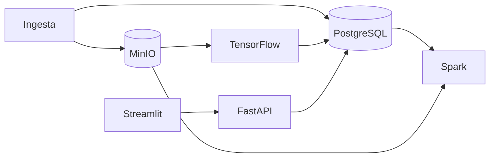

# salle-hospital

Sistema inteligente de soporte hospitalario para **laSalle Health Center**: pipeline de datos a escala, clasificación de radiografías de tórax (Sana / Neumonía / COVID-19) y dashboard operativo.

## Stack

| Componente | Tecnología |
|------------|------------|
| API | FastAPI |
| IA | TensorFlow (Keras) |
| Big Data | Apache Spark (PySpark) |
| Base de datos | PostgreSQL |
| Imágenes / objetos | MinIO |
| Dashboard | Streamlit |
| Infraestructura | Docker Compose |

## Arquitectura

Diagrama y decisiones técnicas: [`docs/architecture.md`](docs/architecture.md).



## Estructura del proyecto

```
├── api/           # REST API
├── dashboard/     # Streamlit
├── ml/            # Modelo y servicio de inferencia (TensorFlow)
├── pipeline/      # Jobs PySpark
├── data/          # Datos locales (gitignored en volumen)
├── docs/          # Documentación
├── infra/         # Configuración auxiliar
└── docker-compose.yml
```

## Requisitos

- Docker 24+ y Docker Compose v2
- (Desarrollo local) Python 3.11+ opcional fuera de contenedores

## Arranque rápido

```bash
cp .env.example .env

# Infraestructura base (PostgreSQL, MinIO, Spark)
docker compose up -d

# Cuando api, ml, dashboard y pipeline estén implementados:
docker compose --profile app up -d
```

### Servicios (día 1 — infra base)

| Servicio | URL |
|----------|-----|
| PostgreSQL | `localhost:5432` |
| MinIO API | http://localhost:9000 |
| MinIO Console | http://localhost:9001 |
| Spark Master UI | http://localhost:8080 |

## Estado del proyecto

| Día | Entregable | Estado |
|-----|------------|--------|
| 1 (1 may) | Arquitectura, estructura, docker-compose base | Completado |
| 2–10 | Pipeline, ML, API, dashboard, automatización | Planificado |

## Planificación

- **1–10 mayo**: desarrollo por fases (definición → datos → ML → integración → memoria).
- Detalle del encargo: ver `enunciado.md` (local).

## Licencia

Proyecto académico — Máster / práctica integrada.
