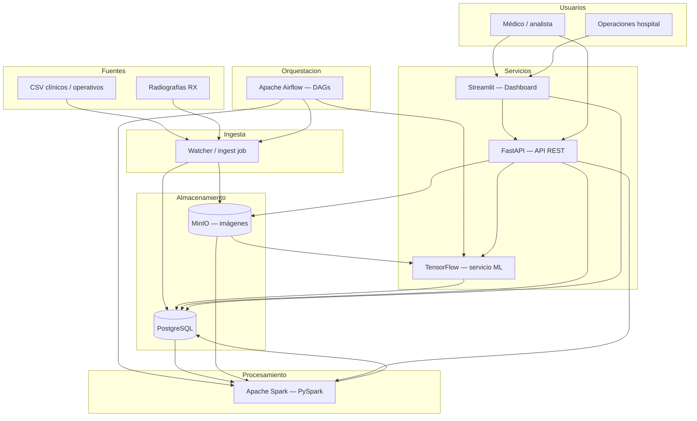

# Arquitectura — laSalle Health Center (salle-hospital)

## 1. Definición del sistema

**salle-hospital** es una plataforma de soporte hospitalario que integra Big Data, automatización y Deep Learning para el **laSalle Health Center**. El sistema cubre el encargo de la práctica: analizar datos clínicos y operativos, clasificar radiografías de tórax, automatizar procesos y visualizar resultados para apoyar decisiones médicas y operativas.

### Problema que resuelve

| Área | Necesidad del hospital | Solución propuesta |
|------|------------------------|-------------------|
| Datos dispersos | Historiales, logs e imágenes sin explotar | Pipeline unificado (ingesta → limpieza → transformación → análisis) |
| Diagnóstico por imagen | Clasificación manual lenta de radiografías | Modelo DL: **Sana / Neumonía / COVID-19** |
| Operaciones | Tareas repetitivas (informes, alertas) | **Apache Airflow** orquesta jobs Spark, alertas e informes |
| Decisión | Falta de visibilidad agregada | Dashboard Streamlit + API REST |

### Alcance funcional (MVP)

1. **Ingesta**: CSV clínicos/operativos e imágenes RX hacia PostgreSQL y MinIO.
2. **Procesamiento**: jobs PySpark (validación, limpieza, agregados, features).
3. **IA**: inferencia y registro de predicciones sobre radiografías almacenadas en MinIO.
4. **API**: FastAPI como fachada (predicciones, pacientes, estado del pipeline, healthchecks).
5. **Dashboard**: Streamlit con métricas, matriz de confusión y alertas simuladas.
6. **Automatización**: DAGs en **Airflow** (ingesta programada, ETL Spark, inferencia ML, informes y alertas).

---

## 2. Stack tecnológico

| Capa | Tecnología | Rol |
|------|------------|-----|
| API | **FastAPI** | REST, orquestación de servicios internos |
| IA | **TensorFlow** (Keras) | Clasificación triple de radiografías de tórax |
| Big Data | **Apache Spark** (PySpark) | ETL y análisis distribuible / escalable |
| Automatización | **Apache Airflow** | Orquestación de pipelines (DAGs, dependencias, reintentos, monitorización) |
| BD relacional | **PostgreSQL** | Pacientes, metadatos, predicciones, logs de pipeline |
| Objetos | **MinIO** (S3-compatible) | Radiografías y artefactos no estructurados |
| Visualización | **Streamlit** | Dashboard clínico-operativo |
| Infra | **Docker + Docker Compose** | Despliegue reproducible |

**Elección TensorFlow** frente a PyTorch: API Keras estable para CNN y transfer learning (ResNet/EfficientNet vía `tf.keras.applications`), exportación **SavedModel** para el servicio `ml` en contenedor y ecosistema maduro de despliegue. Runtime en **Python 3.11** con TensorFlow 2.x.

**Elección Airflow** para automatización: el encargo exige procesos repetibles (ingesta, ETL, alertas, informes). Airflow modela eso como **DAGs** con dependencias explícitas, reintentos, logs y calendario (cron), sin acoplar la lógica de negocio al cron del sistema operativo.

### ¿Por qué PySpark y no pandas?

| Criterio | **pandas** | **PySpark** |
|----------|------------|-------------|
| Escala | Un solo proceso; memoria RAM del nodo | Procesamiento **distribuido** en cluster (master + workers) |
| Volumen | Cómodo hasta GB en una máquina | Pensado para **grandes volúmenes** y múltiples fuentes |
| Encargo práctica | No cubre el requisito de framework Big Data escalable | Cumple explícitamente (Spark/PySpark en el enunciado) |
| Integración | Scripts ad hoc | Encaja con **Airflow** (tareas que lanzan jobs Spark) y almacenes grandes (PostgreSQL, MinIO, parquet) |

En la práctica **no son excluyentes**: pandas puede usarse en notebooks o en el servicio ML para prototipos y preprocesado ligero de imágenes; **PySpark** es la capa de pipeline hospitalario (limpieza masiva de CSV, validación de calidad, agregados operativos) que debe poder **escalar** cuando crezcan los datos. En desarrollo trabajamos con volumen simulado, pero la arquitectura replica un entorno real de Big Data.

---

## 3. Diagrama de arquitectura



### Flujo de datos (resumen)

```
[Fuentes] → Ingesta → [PostgreSQL + MinIO]
                              ↑
                    Airflow (orquesta DAGs)
                              ↓
                         Spark (ETL + calidad)
                              ↓
                    [PostgreSQL procesado]
                              ↓
              ML (inferencia RX) → API ← Dashboard
```

---

## 4. Componentes y responsabilidades

| Componente | Puerto (host) | Responsabilidad |
|------------|---------------|-----------------|
| `postgres` | 5432 | Datos estructurados, resultados, auditoría |
| `minio` | 9000 / 9001 | Bucket de radiografías (`xray-images`) |
| `spark-master` | 8080 (UI) | Coordinación del cluster Spark |
| `spark-worker` | — | Ejecución de jobs PySpark |
| `airflow` (standalone) | 8081 | UI + scheduler + executor en un solo servicio (`airflow standalone`) |
| `api` | 8000 | Endpoints REST, health, proxy a ML |
| `ml` | 8001 | Carga del modelo y predicción |
| `dashboard` | 8501 | Visualización e informes |
| `pipeline` | — | Jobs batch / programados (imagen Spark) |

---

## 5. Modelo de datos (borrador)

**PostgreSQL**

- `patients` — identificador, datos demográficos básicos (anonimizados/simulados).
- `studies` — estudio de imagen, ruta MinIO, timestamps.
- `predictions` — clase predicha, probabilidades, modelo, versión.
- `pipeline_runs` — job, estado, registros procesados, errores de calidad.

**MinIO**

- `xray-images/raw/` — imágenes entrantes.
- `xray-images/processed/` — preprocesadas para inferencia.

---

## 6. Automatizaciones previstas (Airflow)

DAGs planificados (ejemplos):

| DAG / tarea | Acción |
|-------------|--------|
| `ingest_daily` | Detectar nuevos CSV/RX en volumen de ingesta → PostgreSQL / MinIO |
| `etl_spark_quality` | Lanzar job PySpark: limpieza, validación (incompletos, duplicados, corruptos) |
| `ml_batch_inference` | Disparar inferencia TensorFlow sobre estudios pendientes |
| `alerts_and_reports` | Escribir alertas en PostgreSQL; refrescar métricas para Streamlit |

Airflow aporta: **dependencias** entre tareas (ETL antes que ML), **reintentos**, historial de ejecuciones y alertas si un DAG falla (requisito de monitorización del enunciado).

---

## 7. Estructura de repositorio

```
salle-hospital/
├── api/              # FastAPI
├── dashboard/        # Streamlit
├── ml/               # TensorFlow (entrenamiento + inferencia)
├── pipeline/         # Jobs PySpark
├── airflow/          # DAGs y configuración Airflow
├── data/             # Datos locales de desarrollo (no versionados en bloque)
├── docs/             # Arquitectura, especificaciones SDD
├── infra/            # Config Spark, Airflow y utilidades
├── docker-compose.yml
└── README.md
```
