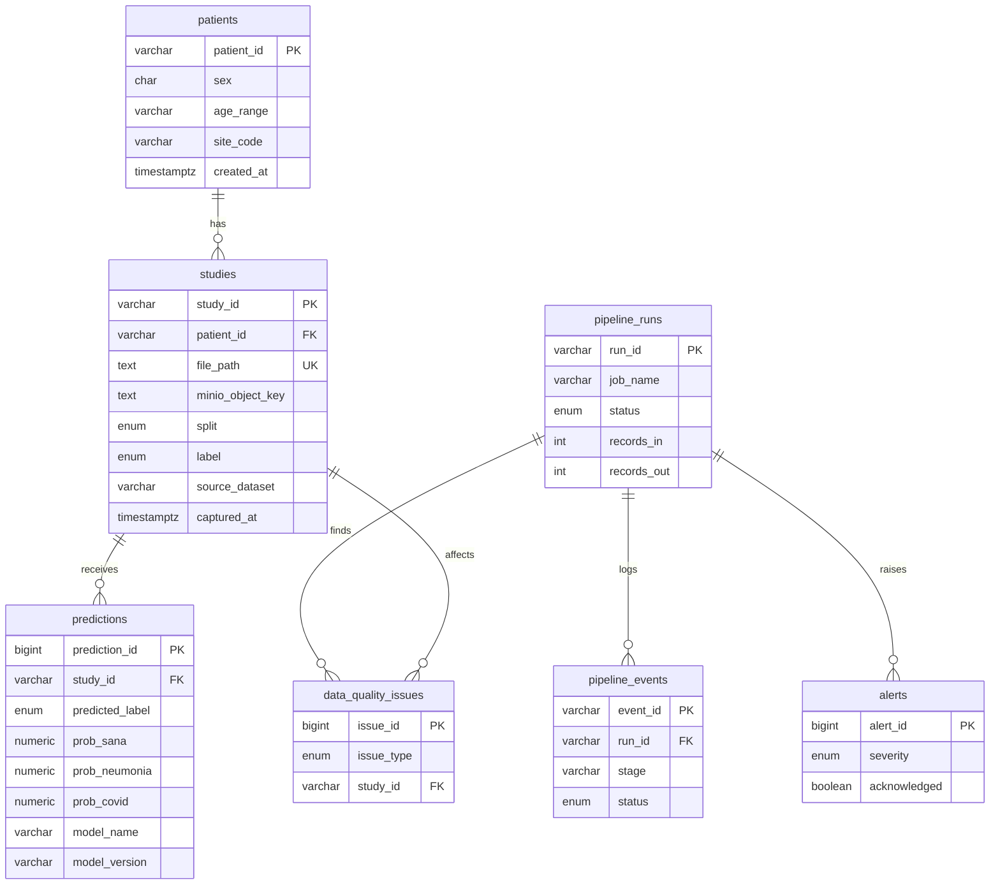

# Arquitectura de base de datos — salle_hospital

PostgreSQL 16 aloja los datos **estructurados** de la aplicación. Las radiografías (no estructuradas) viven en **MinIO**; PostgreSQL guarda metadatos, predicciones, trazas del pipeline y alertas.

DDL y migraciones: [`estructura-repositorio.md`](estructura-repositorio.md#infra--infraestructura) → `infra/postgres/`.

## Instancias lógicas

| Base de datos | Uso | Creación |
|---------------|-----|----------|
| `salle_hospital` | App: pacientes, estudios, ML, pipeline | `POSTGRES_DB` + `01-init-salle-schema.sql` |
| `airflow` | Metadatos Airflow | `02-init-airflow-db.sql` |

Conexión app (Docker):  
`DATABASE_URL` en `.env` (ver `.env.example`; no commitear `.env`)

## Diagrama entidad-relación



## Tablas y responsabilidad

| Tabla | Rol | Origen de datos |
|-------|-----|-----------------|
| `patients` | Paciente anonimizado (ID opaco) | Ingesta D2-03: filas mínimas desde `patient_id` distintos en `studies.csv` |
| `studies` | Metadatos de cada RX + enlace a fichero/MinIO | CSV `studies.csv` + `manifest.csv` |
| `predictions` | Resultado inferencia TensorFlow | Servicio `ml` tras cargar estudio |
| `pipeline_runs` | Cabecera de job (ingesta, ETL, ML batch) | Airflow / Spark |
| `pipeline_events` | Log por etapa dentro de un run | CSV eventos / jobs |
| `data_quality_issues` | Duplicados, incompletos, corruptos | Job PySpark calidad (D2-05) |
| `alerts` | Avisos en dashboard | Reglas post-ETL / fallos DAG |

## Tipos enumerados

| ENUM | Valores | Uso |
|------|---------|-----|
| `study_label` | `sana`, `neumonia`, `covid` | Ground truth y predicción (enunciado 3 clases) |
| `data_split` | `train`, `val`, `test` | Partición ML |
| `pipeline_status` | `pending`, `running`, `ok`, `failed` | Jobs |
| `alert_severity` | `info`, `warning`, `critical` | Dashboard |
| `quality_issue_type` | `incomplete`, `duplicate`, `corrupt`, … | Calidad de datos |

## Relación con MinIO

```
Estudio (PostgreSQL)          Imagen (MinIO)
─────────────────────         ─────────────────────────────
study_id                  →   xray-images/raw/{study_id}.jpg
minio_object_key (nullable)   (relleno tras D2-04)
file_path                     ruta local en ingesta inicial
```

Flujo previsto:

1. Ingesta: `studies.csv` → `studies`; `patients` con INSERT mínimo por `patient_id` único (sin CSV aparte).
2. Carga imágenes: fichero → MinIO → `UPDATE studies SET minio_object_key = …`.
3. Inferencia: ML lee MinIO, escribe `predictions`.

## Vistas

| Vista | Propósito |
|-------|-----------|
| `v_study_counts_by_label` | Conteos por clase y split (dashboard) |
| `v_prediction_summary` | Agregados de probabilidades por clase predicha |

## Scripts SQL

| Archivo | Cuándo se ejecuta |
|---------|-------------------|
| `infra/postgres/01-init-salle-schema.sql` | Primer arranque del volumen Postgres |
| `infra/postgres/02-init-airflow-db.sql` | Idem (usuario/BD Airflow) |

**Importante:** los scripts de `docker-entrypoint-initdb.d` solo corren si el volumen es nuevo. Si ya levantaste Postgres antes:

```bash
docker compose down -v   # borra volumen — pierdes datos locales
docker compose up -d
```

Para aplicar el esquema sin borrar volumen (desarrollo):

```bash
docker exec -i salle-postgres psql -U salle -d salle_hospital < infra/postgres/01-init-salle-schema.sql
```

## Mapeo CSV → tablas

| CSV | Tabla |
|-----|-------|
| `studies.csv` | `studies` + `patients` (IDs únicos, sin demografía inventada) |
| `pipeline_events.csv` | `pipeline_events` (+ fila previa en `pipeline_runs`) |

El script de ingesta (D2-03) debe crear `pipeline_runs` antes de insertar eventos por la FK.

## Índices

Índices en FKs (`patient_id`, `study_id`, `run_id`), filtros de dashboard (`label`, `severity`, `acknowledged`) y orden temporal (`ingested_at`, `inferred_at`).

## Seguridad y ética (simulado)

- Sin nombres, DNI ni contacto; solo `patient_id` opaco.
- Credenciales en `.env` (no versionar).
- En memoria: limitaciones del etiquetado débil y sesgo de clases.

## Referencias

- Spec SDD: [`docs/specs/pipeline-esquema-db.md`](specs/pipeline-esquema-db.md)
- Modelo general: [`architecture.md`](architecture.md)
- Datos raw: [`../data/README.md`](../data/README.md)
