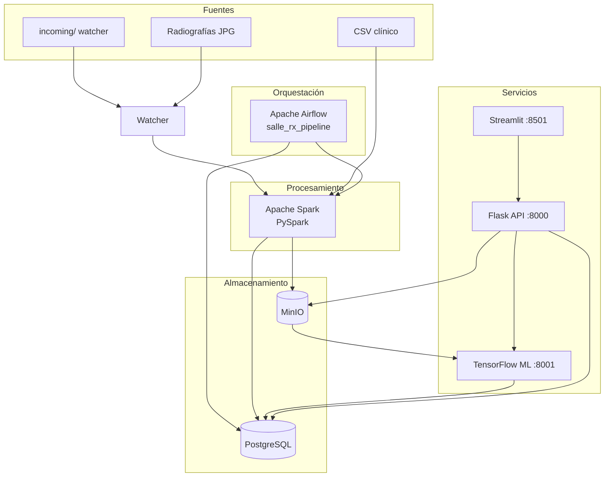
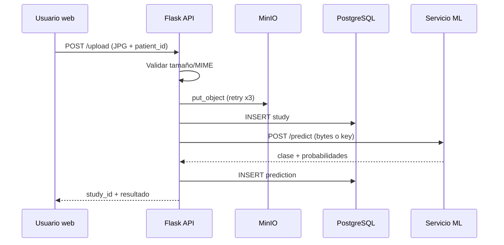
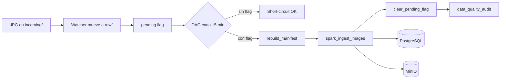
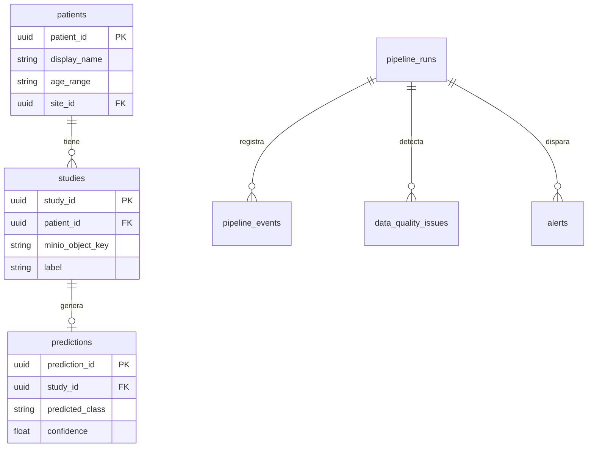
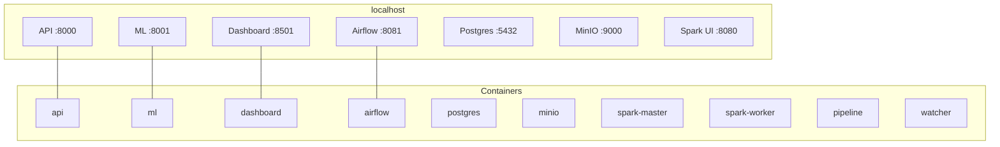
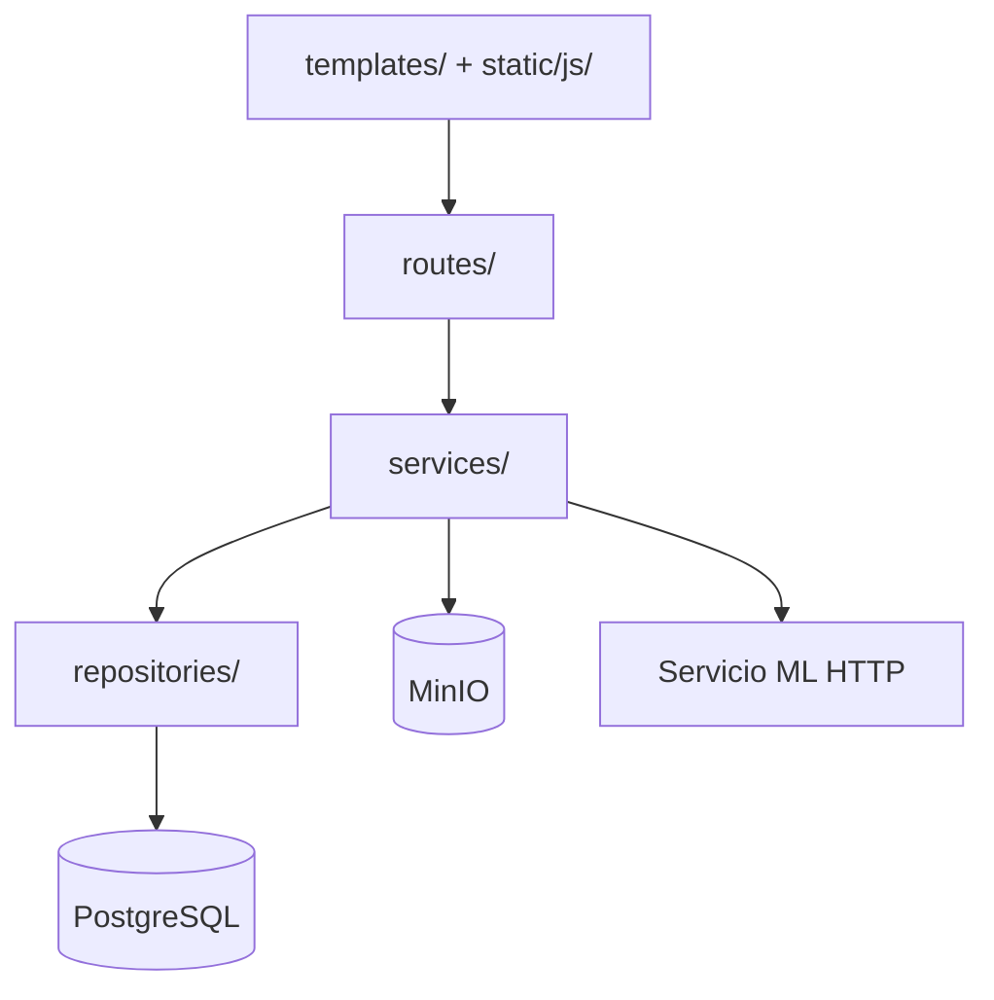

# Diagramas — laSalle Health Center

Diagramas en Mermaid para memoria y presentación. Renderizan en GitHub, VS Code y muchas herramientas de exportación a PDF.

**Estructura de carpetas del código:** [`estructura-repositorio.md`](estructura-repositorio.md) (no confundir con estos diagramas lógicos/de despliegue).

---

## 1. Arquitectura lógica

---

## 2. Flujo de una radiografía clínica (API)

---

## 3. Automatización watcher + Airflow

---

## 4. Modelo de datos (simplificado)

---

## 5. Despliegue Docker Compose

---

## 6. Capas de la API Flask (SDD)

